<p align="center">
  
  
  
  
  
</p>

# Ryujin 龍神

**AI-powered cryptocurrency trading signal intelligence.**

Ryujin watches the market in real time, crunches the numbers with battle-tested technical indicators, scores them into a single actionable signal, and then asks an AI to explain what it all means — in plain English.

> **Ryujin** (Dragon God) — a deity of the sea in Japanese mythology, known for wisdom and control over tides. Just as the dragon commands the ocean, Ryujin helps you read the tides of the crypto market.

> **Not a trading bot.** Ryujin doesn't trade for you. It's a decision-support tool that helps you _understand_ what the market is doing and why.

---

## Table of Contents

- [How It Works](#how-it-works--the-big-picture)
- [Data Flow](#data-flow--step-by-step)
- [Architecture](#architecture-overview)
- [Technical Indicators](#technical-indicators-explained)
- [Signal Scoring](#how-the-composite-score-works)
- [Pattern Detection](#chart-pattern-detection)
- [Real-time WebSocket](#real-time-data--websocket-lifecycle)
- [AI Analysis](#ai-analysis-pipeline)
- [Project Structure](#project-structure)
- [Design Decisions](#key-design-decisions)
- [Getting Started](#getting-started)
- [Tech Stack](#tech-stack)
- [Theme System](#theme-system)
- [Extending Ryujin](#extending-ryujin)
- [API Reference](#api-reference)

---

## How It Works — The Big Picture

Think of Ryujin as a three-stage pipeline. Raw market data flows in from Binance, gets analyzed by mathematical indicators, and then an AI translates the math into human-readable insights.

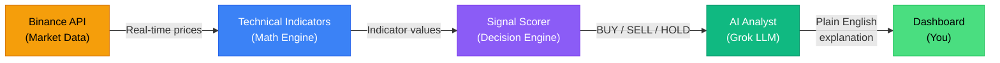

| Stage | What It Does | Where It Runs |
|-------|-------------|---------------|
| **1. Market Data** | Fetches candlestick price data (open, high, low, close, volume) from Binance | Client (browser) |
| **2. Indicators** | Computes RSI, EMA, MACD, Bollinger Bands from the price data | Client (browser) |
| **3. Signal Scoring** | Combines all indicators into a single score from -100 to +100 | Client (browser) |
| **4. Pattern Detection** | Identifies 11 classical chart patterns (Double Top, Head & Shoulders, etc.) | Client (browser) |
| **5. AI Analysis** | LLM explains what the signals mean in everyday language | Server (API route) |

---

## Data Flow — Step by Step

Here's exactly how a price update travels through the entire system, from Binance to your screen:

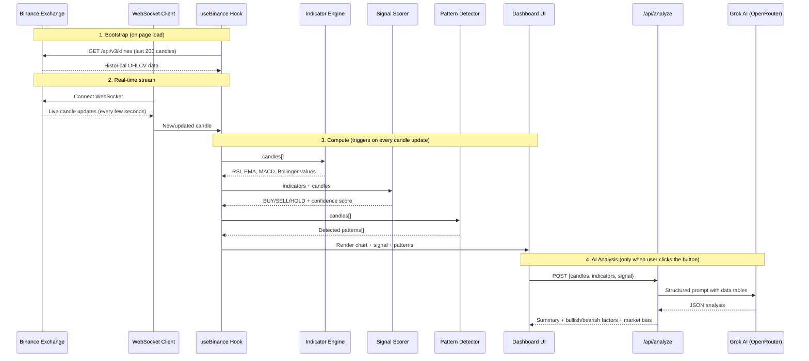

**Key insight:** Steps 1–4 are automatic and free (no API calls). Step 5 only runs when you explicitly click "Run AI Analysis" — this keeps costs down since LLM calls use API credits.

---

## Architecture Overview

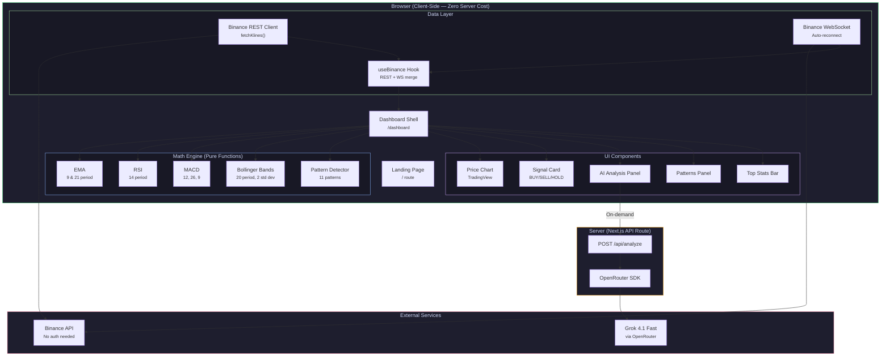

---

## Technical Indicators Explained

Ryujin uses four industry-standard technical indicators. Each one looks at price data from a different angle. Think of them as four expert analysts who each specialize in something different — and together they give a well-rounded picture.

### What Each Indicator Tells You

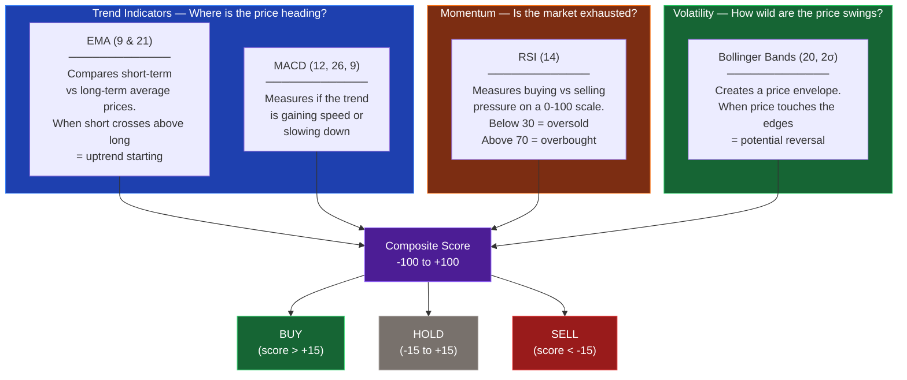

### Quick Reference

| Indicator | What It Measures | Bullish Signal (price may rise) | Bearish Signal (price may fall) |
|-----------|-----------------|----------------|----------------|
| **EMA (9/21)** | Price trend direction | Fast EMA crosses _above_ slow EMA | Fast EMA crosses _below_ slow EMA |
| **RSI (14)** | Buying/selling pressure | Below 30 (oversold — bounce likely) | Above 70 (overbought — dip likely) |
| **MACD** | Trend momentum | Histogram turns positive | Histogram turns negative |
| **Bollinger Bands** | Price volatility | Price near lower band (oversold) | Price near upper band (overbought) |

### The Math Behind Each Indicator

<details>
<summary><strong>EMA — Exponential Moving Average</strong> (click to expand)</summary>

The EMA gives more weight to recent prices, making it react faster to changes than a simple average.

**Formula:**
1. **Seed value** = Simple average of the first N closing prices
2. **Multiplier** `k = 2 / (period + 1)`
3. **Each new EMA** = `(current close - previous EMA) × k + previous EMA`

Ryujin uses EMA(9) for short-term trend and EMA(21) for medium-term. When the faster EMA(9) crosses above the slower EMA(21), it suggests the trend is turning bullish.

</details>

<details>
<summary><strong>RSI — Relative Strength Index</strong> (click to expand)</summary>

RSI measures how fast and how much prices are changing, on a scale of 0 to 100. It uses **Wilder's smoothing method**, which is more stable than a regular average.

**Formula:**
1. Calculate price change for each candle
2. Separate into gains and losses
3. First average = simple mean of first 14 gains/losses
4. Subsequent = `(previousAvg × 13 + currentValue) / 14`
5. RS = averageGain / averageLoss
6. RSI = `100 - (100 / (1 + RS))`

**Scoring thresholds:**
| RSI Value | Meaning | Score |
|:-:|:-:|:-:|
| < 20 | Extremely oversold | +100 |
| 20–30 | Oversold | +70 |
| 30–40 | Mildly bullish | +30 |
| 40–60 | Neutral | 0 |
| 60–70 | Mildly bearish | -30 |
| 70–80 | Overbought | -70 |
| > 80 | Extremely overbought | -100 |

</details>

<details>
<summary><strong>MACD — Moving Average Convergence Divergence</strong> (click to expand)</summary>

MACD reveals changes in trend strength, direction, and momentum by comparing two EMAs of different speeds.

**Formula:**
1. **MACD Line** = EMA(12) - EMA(26)
2. **Signal Line** = EMA(9) of the MACD Line
3. **Histogram** = MACD Line - Signal Line

When the histogram is positive and growing, momentum is bullish. When it flips negative, momentum is turning bearish.

**Minimum data needed:** 26 candles for the slow EMA + 9 for the signal line = **34 candles minimum** before MACD can be computed.

</details>

<details>
<summary><strong>Bollinger Bands</strong> (click to expand)</summary>

Bollinger Bands create a dynamic envelope around the price using standard deviation — a measure of how spread out prices are.

**Formula:**
1. **Middle band** = SMA(20) — simple average of last 20 closes
2. **Standard deviation** = √(Σ(close - SMA)² / 20)
3. **Upper band** = Middle + 2 × StdDev
4. **Lower band** = Middle - 2 × StdDev
5. **%B** = (price - lower) / (upper - lower) — where the price sits within the bands
6. **Bandwidth** = (upper - lower) / middle — how wide the bands are

When bandwidth is very narrow (< 3%), it's called a **"Bollinger Squeeze"** — volatility is coiled up and a big move is likely coming (but the direction is unknown).

</details>

---

## How the Composite Score Works

Each indicator independently produces a score from **-100** (extremely bearish) to **+100** (extremely bullish). Ryujin averages them into a single composite score:

```
Composite = (RSI Score + EMA Score + MACD Score + Bollinger Score) / 4
```

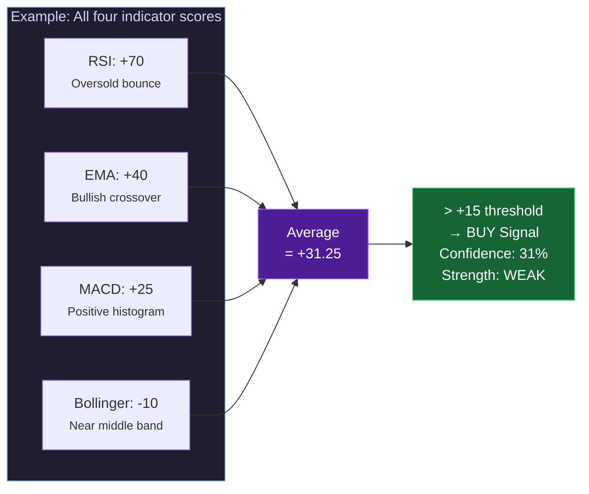

| Composite Score | Direction | What It Means |
|:-:|:-:|:--|
| **> +15** | **BUY** | More indicators are bullish than bearish |
| **-15 to +15** | **HOLD** | Indicators are mixed or neutral — no clear direction |
| **< -15** | **SELL** | More indicators are bearish than bullish |

| Confidence (|composite|) | Strength | What It Means |
|:-:|:-:|:--|
| **70–100** | **STRONG** | Most indicators agree strongly |
| **40–69** | **MODERATE** | Some agreement between indicators |
| **0–39** | **WEAK** | Indicators are conflicting or barely tilted |

---

## Chart Pattern Detection

Beyond mathematical indicators, Ryujin scans for **11 classical chart patterns** — visual formations in price charts that traders have used for over a century to predict where the price might go next.

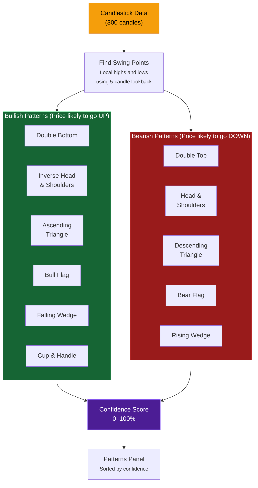

**How detection works:**
1. The algorithm identifies **swing points** — local price peaks and valleys using a 5-candle lookback window
2. These swing points are checked against templates for each known pattern (e.g., two peaks at similar price levels within 1.5% = potential Double Top)
3. Each match gets a **confidence score** based on how closely the price action fits the ideal pattern shape
4. Results are sorted by confidence and displayed in the Patterns panel

---

## Real-time Data — WebSocket Lifecycle

Ryujin maintains a persistent WebSocket connection to Binance for live price updates. Here's how it handles the full lifecycle, including automatic reconnection:

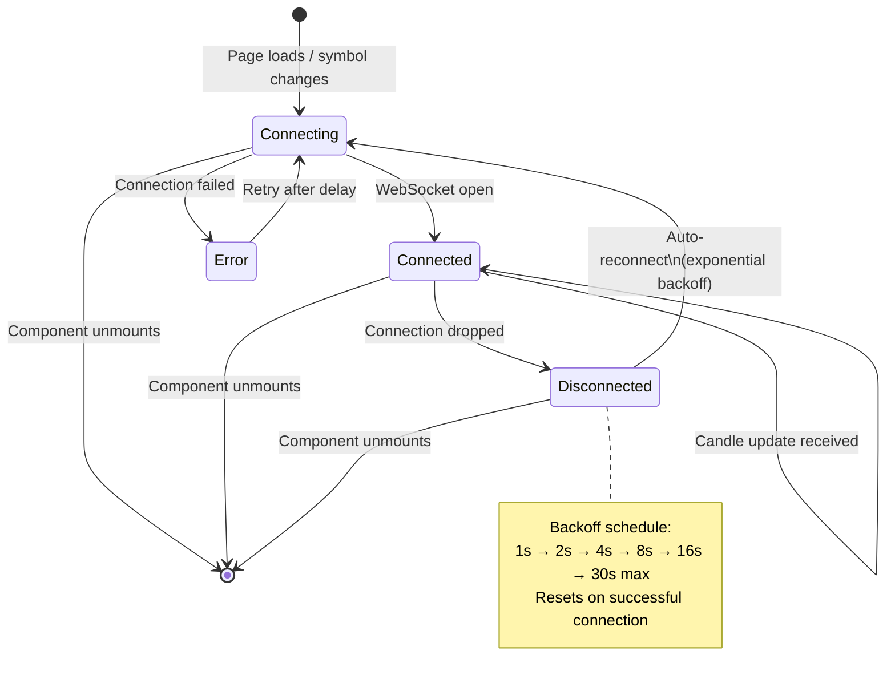

> **Why auto-reconnect?** Binance drops WebSocket connections every 24 hours by exchange policy. The exponential backoff prevents hammering the server if it's temporarily unavailable.

### What happens when a candle update arrives?

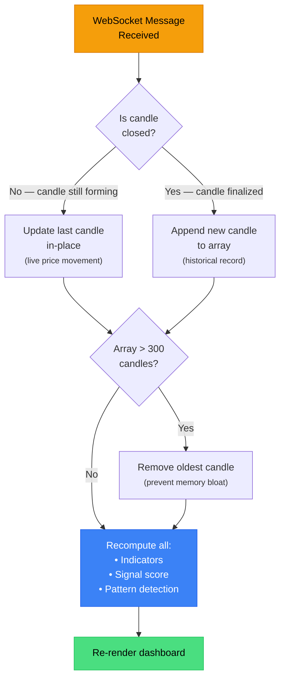

This in-place update approach means you see live price movement within the current candle (the candle updates every few seconds), and when that candle closes, it becomes a permanent part of the historical data.

---

## AI Analysis Pipeline

When you click **"Run AI Analysis"**, here's the full journey from button click to explanation:

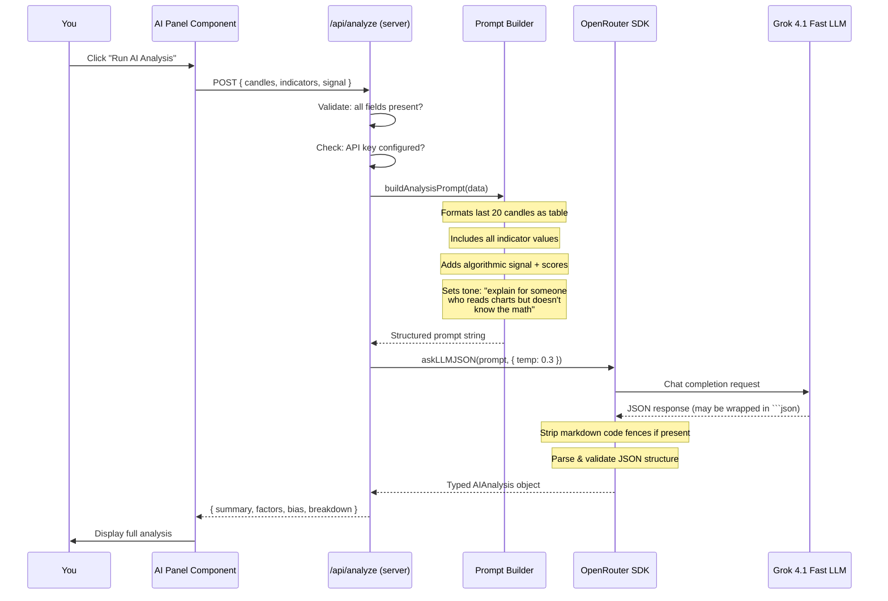

### What the AI returns

| Field | Type | Description |
|-------|------|-------------|
| `summary` | string | 2-3 sentence plain English overview of market conditions |
| `bullishFactors` | string[] | Specific reasons the price might go up |
| `bearishFactors` | string[] | Specific reasons the price might go down |
| `riskFactors` | string[] | Things to watch out for (volatility, low volume, etc.) |
| `indicatorBreakdown` | object[] | Per-indicator analysis with name, value, interpretation, sentiment |
| `marketBias` | number | Overall sentiment from -100 (very bearish) to +100 (very bullish) |

---

## Dashboard Layout

```
+------------------------------------------------------------------+
|  [Price $97,234]  [24H High $98,100]  [Volume 12.3k]  [RSI 62]  |  ← TopStatsBar
+--------------------------------------------+---------------------+
|  [1H] [4H] [1D] [1W]  EMA  BB        Live |  AI Analysis Panel  |
|                                             |                     |
|  +---------------------------------------+  |  [Run AI Analysis]  |
|  |                                       |  |                     |
|  |     TradingView Candlestick Chart     |  |  +-- BUY -- 75% --+|
|  |     + EMA overlays + Bollinger        |  |  |  MODERATE       ||
|  |     + zoom / pan / crosshair          |  |  |  Score: +22.5   ||
|  |                                       |  |  +----------------+|
|  +---------------------------------------+  |                     |
|  | RSI(14) sub-chart     ----70----      |  |  > Bullish Factors  |
|  | ~~~~~~~~~~~~~~~~line  ----30----      |  |  > Bearish Factors  |
|  +---------------------------------------+  |  > Risk Factors     |
|                                             |  > Indicator Detail  |
+--------------------------------------------+---------------------+
         ~70% width                                ~30% width
```

---

## Project Structure

```
ryujin/
├── app/                             # Next.js App Router
│   ├── page.tsx                     # Landing page route (/)
│   ├── layout.tsx                   # Root layout (theme init, fonts)
│   ├── globals.css                  # Theme tokens + CSS animations
│   ├── dashboard/page.tsx           # Dashboard route (/dashboard)
│   └── api/analyze/route.ts         # AI analysis API endpoint
│
├── lib/                             # Core logic (no UI code here)
│   ├── types.ts                     # All TypeScript interfaces
│   ├── openrouter.ts                # LLM client (askLLM, askLLMJSON)
│   ├── utils.ts                     # cn() helper for class names
│   ├── binance/
│   │   ├── client.ts                # REST API — fetchKlines()
│   │   ├── websocket.ts             # WebSocket with auto-reconnect
│   │   └── use-binance.ts           # React hook (REST bootstrap + WS merge)
│   ├── indicators/
│   │   ├── ema.ts                   # Exponential Moving Average
│   │   ├── rsi.ts                   # Relative Strength Index (Wilder's)
│   │   ├── macd.ts                  # MACD line + signal + histogram
│   │   ├── bollinger.ts             # Bollinger Bands + bandwidth
│   │   └── index.ts                 # computeAllIndicators() barrel
│   ├── patterns/
│   │   └── detector.ts              # 11 chart pattern detectors
│   └── signals/
│       └── scorer.ts                # Composite signal generator
│
├── components/
│   ├── landing/                     # Landing page
│   │   ├── landing-page.tsx         # Hero section, features, CTA
│   │   ├── dragon-logo.tsx          # Animated pixel-art SVG dragon
│   │   └── animated-chart.tsx       # Background chart animation
│   ├── dashboard/                   # Dashboard
│   │   ├── dashboard-shell.tsx      # Main orchestrator (state + layout)
│   │   ├── price-chart.tsx          # TradingView chart wrapper
│   │   ├── ai-analysis-panel.tsx    # AI results + patterns sidebar
│   │   ├── signal-card.tsx          # BUY/SELL/HOLD display
│   │   ├── patterns-panel.tsx       # Pattern detection results
│   │   ├── top-stats-bar.tsx        # Price, volume, RSI stats
│   │   ├── chart-toolbar.tsx        # Timeframe & overlay controls
│   │   └── symbol-toggle.tsx        # BTC/ETH switcher
│   └── ui/                          # shadcn/ui primitives
│
└── prompts/
    └── analyze-signal.ts            # AI prompt template builder
```

---

## Key Design Decisions

### Client-side computation vs server-side

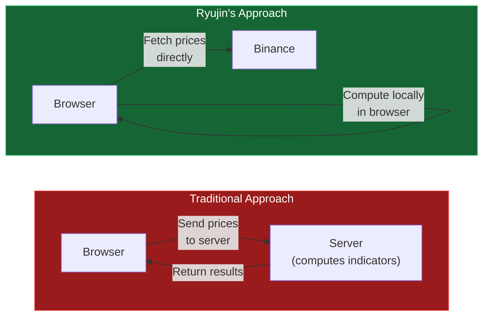

| | Traditional | Ryujin |
|-|-------------|--------|
| **Server cost** | Pay to compute every update | **$0** (all math runs in browser) |
| **Latency** | Network round-trip to your server | **Instant** (local computation) |
| **Scalability** | Need bigger server as users grow | **Unlimited** (each browser does its own math) |

The trade-off is CPU usage in the browser — but computing all four indicators on 300 candles takes **< 1ms** on modern hardware.

### On-demand AI (not automatic)

LLM API calls cost money and take ~2-3 seconds. Instead of running AI on every price tick (expensive and noisy), Ryujin only calls the AI when you explicitly click **"Run AI Analysis"**. This keeps your API budget under control.

### Pure functions for all math

Every indicator is a stateless function: `candles[] → number[]`. No classes, no hidden state, no side effects. This makes them trivially testable and debuggable — same input always produces the same output.

---

## Getting Started

### Prerequisites

- **Node.js** 18+ and **npm**
- An **OpenRouter API key** ([get one here](https://openrouter.ai/keys))

### Installation

```bash
# Clone the repository
git clone <repo-url>
cd ryu-self-learning-agents

# Install dependencies
npm install
```

Create `.env.local` in the project root:

```bash
# OpenRouter API key (get one at https://openrouter.ai/keys)
OPENROUTER_API_KEY=sk-or-v1-your-key-here

# Model (default: x-ai/grok-4.1-fast — see https://openrouter.ai/models for options)
OPENROUTER_MODEL=x-ai/grok-4.1-fast
```

### Run

```bash
npm run dev
```

Open [http://localhost:3000](http://localhost:3000) — you'll land on the Ryujin homepage. Click **"Launch Dashboard"** to start analyzing.

> **Note:** Binance market data requires **no API key** — it uses free public endpoints. You only need the OpenRouter key for AI analysis.

---

## Tech Stack

| Layer | Technology | Why This Choice |
|-------|-----------|-----------------|
| **Framework** | Next.js 16 + React 19 | App Router for server components, API routes for AI endpoint |
| **Language** | TypeScript 5 (strict mode) | Type safety across the entire data pipeline |
| **Styling** | Tailwind CSS 4 + shadcn/ui | Utility-first CSS + accessible, customizable components |
| **Charting** | TradingView lightweight-charts v5 | Professional-grade, canvas-based, 40KB — used by real trading platforms |
| **Market Data** | Binance REST + WebSocket | Free, reliable, no authentication required |
| **AI** | Grok 4.1 Fast via OpenRouter | Fast structured JSON output, easily swappable for any model |
| **Fonts** | JetBrains Mono + Geist | Monospace for numbers/data, proportional for text |

---

## Theme System

Ryujin ships with a dark mode default and an animated light/dark toggle using the **View Transition API** — the theme change radiates outward as a circular reveal from the toggle button.

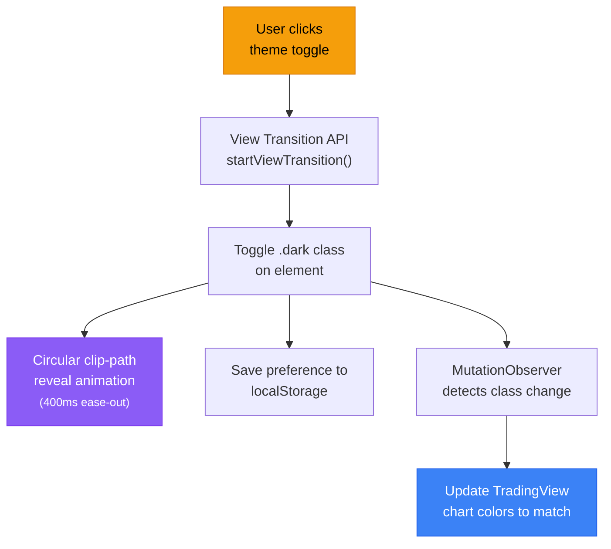

A blocking `<script>` in the `<head>` tag reads the saved theme from `localStorage` _before the first paint_, preventing any flash of the wrong theme (FOUC).

---

## Extending Ryujin

### Add a new indicator

1. Create `lib/indicators/your-indicator.ts` — a pure function `(candles: Candle[]) → number[]`
2. Add the return type to `IndicatorData` in `lib/types.ts`
3. Call it from `computeAllIndicators()` in `lib/indicators/index.ts`
4. Add a scoring function in `lib/signals/scorer.ts`
5. Update the prompt in `prompts/analyze-signal.ts` to include the new values

### Add a new trading pair

Add an entry to the `SYMBOLS` array in `lib/types.ts`:

```typescript
{ symbol: "SOLUSDT", label: "SOL/USDT", base: "SOL" }
```

### Switch LLM models

Change `OPENROUTER_MODEL` in `.env.local`. Any model on [OpenRouter](https://openrouter.ai/models) works:

```bash
OPENROUTER_MODEL=x-ai/grok-4.1-fast           # Default — fast, great for JSON
OPENROUTER_MODEL=anthropic/claude-sonnet-4-5   # Anthropic
OPENROUTER_MODEL=openai/gpt-4o                 # OpenAI
OPENROUTER_MODEL=google/gemini-2.5-flash-preview  # Google
```

---

## API Reference

### `POST /api/analyze`

Sends market data to the LLM for AI-powered analysis.

**Request body:**

```json
{
  "candles": [{ "time": 1700000000, "open": 97000, "high": 97500, "low": 96500, "close": 97200, "volume": 100 }],
  "indicators": {
    "ema": { "ema9": 97300, "ema21": 97100 },
    "rsi": { "value": 62.5 },
    "macd": { "macd": 150, "signal": 120, "histogram": 30 },
    "bollinger": { "upper": 98500, "middle": 97200, "lower": 95900, "bandwidth": 0.027 }
  },
  "signal": {
    "direction": "BUY",
    "confidence": 45,
    "strength": "MODERATE",
    "composite": 22.5,
    "scores": [{ "name": "RSI(14)", "score": 0, "reason": "Neutral" }]
  }
}
```

**Response (200):**

```json
{
  "summary": "Bitcoin is showing mild bullish momentum...",
  "bullishFactors": ["EMA9 crossing above EMA21 indicates trend reversal"],
  "bearishFactors": ["RSI approaching overbought territory at 68"],
  "riskFactors": ["Bollinger squeeze suggests imminent volatility expansion"],
  "indicatorBreakdown": [
    {
      "name": "RSI(14)",
      "value": "62.5",
      "interpretation": "RSI is in neutral territory but trending upward...",
      "sentiment": "neutral"
    }
  ],
  "marketBias": 35
}
```

**Error responses:**

| Status | Meaning |
|--------|---------|
| `400` | Missing required fields in request body |
| `401` | OpenRouter API key invalid or missing |
| `500` | AI analysis failed (check server logs) |

---

## Environment Variables

| Variable | Required | Description |
|----------|:--------:|-------------|
| `OPENROUTER_API_KEY` | Yes | Your OpenRouter API key ([get one here](https://openrouter.ai/keys)) |
| `OPENROUTER_MODEL` | No | Model ID — defaults to `x-ai/grok-4.1-fast` |

---

## Development

```bash
npm run dev       # Start dev server (Turbopack)
npm run build     # Production build
npm run start     # Start production server
npm run lint      # Run ESLint
```

---

## Disclaimer

Ryujin is an **educational and research tool**. It does not constitute financial advice. Cryptocurrency trading involves substantial risk of loss. Always do your own research and never invest more than you can afford to lose. Past indicator performance does not guarantee future results.

---

<p align="center">
  <strong>Ryujin 龍神</strong> — See the signal. Understand the why.
</p>
